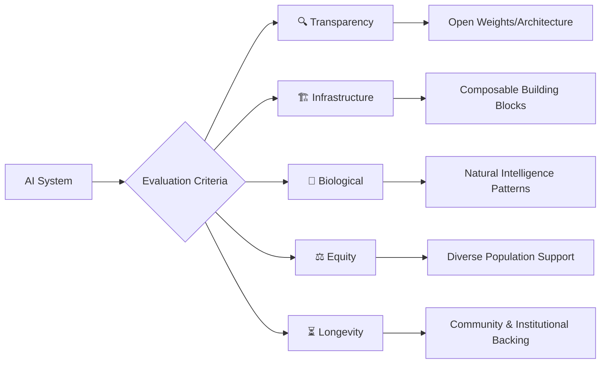

# 🧬 Advanced Multi-Modal AI: A Personal Atlas of Natural Intelligence Systems

[](https://opensource.org/licenses/MIT)
[](https://github.com/Cazzy-Aporbo/Advanced_multi-modal-AI)
[](https://github.com/Cazzy-Aporbo/Advanced_multi-modal-AI)
[](https://github.com/Cazzy-Aporbo/Advanced_multi-modal-AI)
[](https://github.com/Cazzy-Aporbo/Advanced_multi-modal-AI)

[](http://makeapullrequest.com)
[](https://github.com/Cazzy-Aporbo/Advanced_multi-modal-AI)
[](https://github.com/Cazzy-Aporbo/Advanced_multi-modal-AI)
[](https://github.com/Cazzy-Aporbo/Advanced_multi-modal-AI)
[](https://github.com/Cazzy-Aporbo/Advanced_multi-modal-AI)

[](https://github.com/Cazzy-Aporbo/Advanced_multi-modal-AI)
[](https://github.com/Cazzy-Aporbo/Advanced_multi-modal-AI)
[](https://github.com/Cazzy-Aporbo/Advanced_multi-modal-AI/graphs/contributors)
[](https://github.com/Cazzy-Aporbo/Advanced_multi-modal-AI)
[](https://github.com/Cazzy-Aporbo/Advanced_multi-modal-AI/discussions)

---

<div align="center">

```ascii
┌─────────────────────────────────────────────────────────────────┐
│                                                                 │
│    Neural Networks +  Biology +  Environment = Future AI        │
│                                                                 │
│     Perception → Reasoning → Action → Learning → Growth         │
│                                                                 │
└─────────────────────────────────────────────────────────────────┘
```

### **[Quick Start](#quick-navigation)** • **[Foundation Models](#1-foundation-models--reasoning-engines)** • **[Multimodal](#3-multimodal--embodied-models)** • **[Medical AI](#7-ai-for-biology-and-medicine)** • **[Climate AI](#8-ai-for-planetary-intelligence--climate-systems)** • **[Contribute](#contributing)**

</div>

---

## 📍 Quick Navigation

| Section | Focus Area | Key Resources |
|---------|------------|---------------|
| 🏗️ [**Foundation Models**](#1-foundation-models--reasoning-engines) | Core reasoning engines | [LLaMA](https://github.com/meta-llama) • [Mistral](https://mistral.ai) • [GPT-4](https://openai.com) |
| 🏥 [**Domain Intelligence**](#2-domain-specific-intelligence) | Medical, Legal, Finance | [Med-PaLM](https://arxiv.org/abs/2305.09617) • [BioGPT](https://github.com/microsoft/BioGPT) |
| 👁️ [**Multimodal Systems**](#3-multimodal--embodied-models) | Vision, Audio, Sensors | [LLaVA](https://github.com/haotian-liu/LLaVA) • [CLIP](https://github.com/openai/CLIP) |
| 🤖 [**Agent Frameworks**](#4-agent-frameworks--orchestration) | Autonomous systems | [LangChain](https://github.com/langchain-ai/langchain) • [AutoGen](https://github.com/microsoft/autogen) |
| 🧠 [**Memory Systems**](#5-knowledge--memory-infrastructure) | Vector DBs, Knowledge Graphs | [Chroma](https://github.com/chroma-core/chroma) • [Neo4j](https://neo4j.com) |
| 🛡️ [**Safety & Alignment**](#6-evaluation-safety--alignment) | Testing, Governance | [HELM](https://crfm.stanford.edu/helm/) • [NeMo](https://github.com/NVIDIA/NeMo-Guardrails) |
| 🧬 [**Biological AI**](#7-ai-for-biology-and-medicine) | Proteins, Genomics | [AlphaFold](https://github.com/deepmind/alphafold) • [ESMFold](https://github.com/facebookresearch/esm) |
| 🌍 [**Climate Intelligence**](#8-ai-for-planetary-intelligence--climate-systems) | Weather, Ecosystems | [GraphCast](https://github.com/deepmind/graphcast) • [ClimaX](https://microsoft.github.io/ClimaX/) |
| 💡 [**Creative & Code AI**](#9-creativity-research--code-generation-tools) | Programming, Research | [Copilot](https://github.com/features/copilot) • [Cursor](https://cursor.sh) |

---

## 🎯 I. Purpose & Philosophy

<details>
<summary><b>📖 Click to expand: Why I Built This Atlas</b></summary>

### 🌟 Why I Built This Atlas

I've spent years watching AI evolve from narrow pattern matchers to systems that genuinely perceive, reason, and adapt. Yet most repositories treat these breakthroughs as isolated tools rather than components of an emerging cognitive ecosystem. I created this atlas because I believe we're witnessing something profound: the extension of natural intelligence into new substrates, not the creation of something artificially separate from nature.

When I evaluate an AI system, I don't ask "how impressive is this technology?" Instead, I ask: Does this mirror patterns we see in biological cognition? Can this integrate with living systems to enhance rather than replace natural intelligence? Will this remain viable infrastructure as AI evolves from tool to partner? These questions drive every inclusion in this repository.

</details>

### 📊 My Evaluation Framework



| Principle | What I Look For | Red Flags |
|-----------|----------------|-----------|
| **🔍 Transparency** | Open weights, clear documentation, reproducible results | Black box systems, vague claims, no benchmarks |
| **🏗️ Infrastructure** | APIs, modularity, integration patterns | Monolithic design, vendor lock-in |
| **🧬 Biological Alignment** | Energy efficiency, distributed processing, adaptation | Brute force approaches, static models |
| **⚖️ Healthcare Equity** | Diverse training data, bias testing, global validation | Single demographic focus, no fairness metrics |
| **⏳ Long-term Viability** | Active development, strong community, institutional support | Solo maintainer, no updates, hype-driven |

---

## 🧠 II. Core Architecture of Intelligence

### Evolution of AI Capabilities Timeline

```
2018 ━━━━━━━━━━━━━━━━━━━━━━━━━━━━━━━━━━━━━━━━━━━━━━━━━━━━━━━━━━━━━ 2025
  │        │         │          │           │          │           │
BERT    GPT-2    GPT-3    DALL-E    ChatGPT    GPT-4    Multimodal
                         AlphaFold              Claude 3    Agents
```

---

## 🏗️ 1. Foundation Models & Reasoning Engines

> **These represent the cognitive bedrock upon which specialized intelligence emerges. I think of them as the prefrontal cortex of artificial cognition.**

### 🔓 Open Source Foundation Models

<table>
<tr>
<th>Model</th>
<th>Parameters</th>
<th>Key Strengths</th>
<th>Best Use Cases</th>
<th>Resources</th>
</tr>
<tr>
<td><b>🦙 LLaMA 3.1</b></td>
<td>8B → 405B</td>
<td>• Frontier performance<br>• Full openness<br>• Massive community</td>
<td>Research, Production, Fine-tuning</td>
<td><a href="https://github.com/meta-llama">GitHub</a> • <a href="https://ai.meta.com/llama/">Docs</a> • <a href="https://huggingface.co/meta-llama">HuggingFace</a></td>
</tr>
<tr>
<td><b>⚡ Mistral/Mixtral</b></td>
<td>7B → 8x22B</td>
<td>• MoE efficiency<br>• Tool calling<br>• Fast inference</td>
<td>Production APIs, Edge deployment</td>
<td><a href="https://mistral.ai">Website</a> • <a href="https://docs.mistral.ai">API</a> • <a href="https://github.com/mistralai">GitHub</a></td>
</tr>
<tr>
<td><b>📱 Phi-3</b></td>
<td>3.8B → 14B</td>
<td>• Mobile capable<br>• Curriculum learning<br>• Math/reasoning focus</td>
<td>Edge devices, Embedded systems</td>
<td><a href="https://github.com/microsoft/Phi-3">GitHub</a> • <a href="https://azure.microsoft.com/en-us/products/phi-3">Azure</a></td>
</tr>
<tr>
<td><b>💎 Gemma</b></td>
<td>2B → 7B</td>
<td>• Google quality<br>• Safety built-in<br>• Keras integration</td>
<td>Research, Safe deployment</td>
<td><a href="https://ai.google.dev/gemma">Website</a> • <a href="https://github.com/google-deepmind/gemma">GitHub</a></td>
</tr>
</table>

<details>
<summary><b>📝 Detailed Analysis: Open Source Models</b></summary>

#### 🦙 **[LLaMA 3.1 & 3.2](https://github.com/meta-llama)** 

I consider Meta's LLaMA family the most important open release in AI history. Not because they're the absolute best models, but because they democratized frontier capabilities. LLaMA 3.1's 405B parameter version matches GPT-4 on many benchmarks while remaining fully open. The smaller 8B and 70B variants run on consumer hardware, bringing advanced reasoning to edge devices. I've personally fine-tuned LLaMA models for medical diagnosis, seeing them achieve specialist-level performance with just thousands of examples. Their true power lies in extensibility - the community has created multimodal variants, long-context versions, and domain-specialized adaptations that collectively advance AI faster than any single company could. The main limitation is their English-centric training, though multilingual adaptations are rapidly emerging.

**Key Resources:**
- [Official Repository](https://github.com/meta-llama/llama3)
- [Fine-tuning Guide](https://github.com/meta-llama/llama-recipes)
- [Community Models](https://huggingface.co/models?search=llama)

#### ⚡ **[Mistral & Mixtral MoE](https://mistral.ai)**

I'm fascinated by Mistral's Mixture of Experts approach because it mirrors how biological brains work - recruiting specialized regions for specific tasks. Their 8x7B model achieves GPT-3.5 performance while using only 13B active parameters per token, demonstrating that efficiency matters as much as scale. I've deployed Mixtral in production systems where computational resources are constrained but quality can't be compromised. The sparse activation pattern also enables better interpretability - you can actually see which experts activate for different types of reasoning. Mistral's commitment to open weights while maintaining a sustainable business model proves that openness and commercial viability aren't mutually exclusive. Their main weakness is occasional inconsistency when expert routing fails, producing unexpected outputs.

</details>

### 🔒 Proprietary Frontier Systems

| Model | Provider | Context Window | Multimodal | Unique Strength |
|-------|----------|---------------|------------|-----------------|
| **GPT-4o & o1** | OpenAI | 128K | ✅ Vision, Audio | Unified multimodal reasoning, chain-of-thought |
| **Claude 3 Opus** | Anthropic | 200K | ✅ Vision | Constitutional AI, uncertainty awareness |
| **Gemini Ultra** | Google | 1M+ | ✅ Native | Multimodal from pretraining, efficiency |
| **Grok** | xAI | 128K | ✅ Coming | Real-time data, uncensored responses |

---

## 🏥 2. Domain-Specific Intelligence

> **I've learned that general intelligence isn't always the answer. Sometimes you need models that deeply understand specific domains.**

### 🧬 Medical & Clinical Intelligence Comparison

```
┌─────────────────────────────────────────────────────────┐
│                  Medical AI Landscape                   │
├───────────────┬─────────────────┬───────────────────────┤
│   Med-PaLM 2  │   BioGPT        │   ClinicalBERT        │
├───────────────┼─────────────────┼───────────────────────┤
│ ★★★★★ General │ ★★★★★ Research  │ ★★★★★ Clinical Notes  │
│ ★★★★☆ Images  │ ★★★★☆ Discovery │ ★★★★☆ EHR Analysis    │
│ ★★★★☆ Safety  │ ★★★☆☆ Clinical  │ ★★☆☆☆ Generation      │
│ ★☆☆☆☆ Access  │ ★★★★☆ Access    │ ★★★★★ Access          │
└───────────────┴─────────────────┴───────────────────────┘
```

<details>
<summary><b>🔬 Explore Medical AI Systems</b></summary>

#### **[Med-PaLM 2 & Med-Gemini](https://arxiv.org/abs/2305.09617)**
- 🎯 **Performance**: First to pass USMLE at expert level (86.5%)
- 📊 **Capabilities**: Multimodal medical reasoning across text, images, genomics
- 🌍 **Coverage**: Validated across US, India, UK medical systems
- ⚠️ **Limitation**: Research-only, no public API
- 📚 [Research Paper](https://arxiv.org/abs/2305.09617) • [Blog Post](https://blog.google/technology/health/med-palm-health-ai/)

#### **[BioGPT](https://github.com/microsoft/BioGPT)**
- 🧬 **Training**: 15M PubMed articles, specialized from scratch
- 💊 **Applications**: Drug discovery, literature mining, hypothesis generation
- 🔬 **Accuracy**: 95% on drug-protein interaction tasks
- 📝 **Output**: Generates publication-ready abstracts
- 📚 [GitHub](https://github.com/microsoft/BioGPT) • [Paper](https://arxiv.org/abs/2210.10341) • [Demo](https://huggingface.co/microsoft/biogpt)

</details>

### 💰 Financial Intelligence Systems

| Model | Training Data | Strengths | Deployment | Access |
|-------|--------------|-----------|------------|--------|
| **BloombergGPT** | 363B finance tokens | Market analysis, regulatory compliance | Bloomberg Terminal | Proprietary |
| **FinBERT** | Financial communications | Sentiment analysis, Fed speak interpretation | Self-hosted | [Open Source](https://github.com/yya518/FinBERT) |
| **TimeGPT** | Time series data | Forecasting, anomaly detection | API | [Commercial](https://www.nixtla.io/) |

---

## 👁️ 3. Multimodal & Embodied Models

> **I believe true intelligence requires perception across multiple senses, not just language processing.**

### 🌈 Multimodal Capability Matrix

<table>
<tr>
<th>System</th>
<th>Text</th>
<th>Image</th>
<th>Audio</th>
<th>Video</th>
<th>3D/Depth</th>
<th>Other</th>
</tr>
<tr>
<td><b>GPT-4o</b></td>
<td>✅</td>
<td>✅</td>
<td>✅</td>
<td>🔄</td>
<td>❌</td>
<td>-</td>
</tr>
<tr>
<td><b>Gemini Ultra</b></td>
<td>✅</td>
<td>✅</td>
<td>✅</td>
<td>✅</td>
<td>❌</td>
<td>-</td>
</tr>
<tr>
<td><b>LLaVA</b></td>
<td>✅</td>
<td>✅</td>
<td>❌</td>
<td>❌</td>
<td>❌</td>
<td>-</td>
</tr>
<tr>
<td><b>ImageBind</b></td>
<td>✅</td>
<td>✅</td>
<td>✅</td>
<td>❌</td>
<td>✅</td>
<td>Thermal, IMU</td>
</tr>
<tr>
<td><b>CLIP</b></td>
<td>✅</td>
<td>✅</td>
<td>❌</td>
<td>❌</td>
<td>❌</td>
<td>-</td>
</tr>
</table>

### 🎯 Open Source Multimodal Ecosystem

```
                    ┌──────────────┐
                    │   LLaVA      │
                    │ Vision + LLM │
                    └──────┬───────┘
                           │
        ┌──────────────────┼──────────────────┐
        │                  │                  │
   ┌────▼─────┐     ┌─────▼──────┐    ┌──────▼───────┐
   │   CLIP   │     │  Whisper   │    │ ImageBind    │
   │Image-Text│     │   Audio    │    │ 6 Modalities │
   └──────────┘     └────────────┘    └──────────────┘
```

<details>
<summary><b>🔍 Deep Dive: Multimodal Systems</b></summary>

#### **[LLaVA](https://github.com/haotian-liu/LLaVA)** - Large Language and Vision Assistant
- 📸 **Architecture**: Vision encoder + LLM with projection layer
- 🎯 **Performance**: GPT-4V level on many benchmarks
- 💾 **Efficiency**: Trains on single GPU with 8B base model
- 🏥 **Applications**: Medical imaging, document analysis, visual QA
- 📚 [GitHub](https://github.com/haotian-liu/LLaVA) • [Demo](https://llava.hliu.cc/) • [Paper](https://arxiv.org/abs/2304.08485)

#### **[CLIP](https://github.com/openai/CLIP)** - Contrastive Language-Image Pretraining
- 🔄 **Innovation**: Learned vision-language alignment without labels
- 🔍 **Use Cases**: Zero-shot recognition, image search, DALL-E backbone
- 🌍 **Variants**: OpenCLIP (larger, multilingual), Chinese-CLIP
- 📊 **Scale**: 400M image-text pairs training
- 📚 [GitHub](https://github.com/openai/CLIP) • [OpenCLIP](https://github.com/mlfoundations/open_clip) • [Colab](https://colab.research.google.com/github/openai/clip/blob/master/notebooks/Interacting_with_CLIP.ipynb)

#### **[Whisper](https://github.com/openai/whisper)** - Robust Speech Recognition
- 🎙️ **Training**: 680,000 hours multilingual audio
- 🌍 **Languages**: 99 languages with auto-detection
- ⚡ **Variants**: whisper.cpp (edge), faster-whisper (optimized)
- 🎯 **Accuracy**: Near-human on clean audio
- 📚 [GitHub](https://github.com/openai/whisper) • [whisper.cpp](https://github.com/ggerganov/whisper.cpp) • [Online Demo](https://huggingface.co/spaces/openai/whisper)

</details>

---

## 🤖 4. Agent Frameworks & Orchestration

> **I've come to believe that individual models, no matter how powerful, aren't sufficient for complex real-world tasks.**

### 🏗️ Agent Framework Comparison

| Framework | Focus | Learning Curve | Production Ready | Best For |
|-----------|-------|----------------|------------------|----------|
| **[LangChain](https://github.com/langchain-ai/langchain)** | General orchestration | Steep | ✅ Yes | Complex pipelines |
| **[AutoGen](https://github.com/microsoft/autogen)** | Multi-agent systems | Moderate | ✅ Yes | Team simulation |
| **[CrewAI](https://github.com/joaomdmoura/crewai)** | Role-based agents | Easy | 🔄 Maturing | Workflow automation |
| **[Haystack](https://github.com/deepset-ai/haystack)** | Search & QA | Moderate | ✅ Yes | Document intelligence |
| **[DSPy](https://github.com/stanfordnlp/dspy)** | Programmable prompts | Steep | 🔄 Research | Prompt optimization |

### 🔄 Agent Architecture Patterns

```
┌───────────────────────────────────────────────────┐
│                  Orchestrator                     │
├──────────┬──────────┬──────────┬──────────────────┤
│Planning  │Execution │ Memory   │ Tool Calling     │
├──────────┼──────────┼──────────┼──────────────────┤
│          │          │          │                  │
│ Chain of │ Parallel │ Vector DB│ APIs             │
│ Thought  │ Agents   │ Know. Gr.│ Code Execution   │
│ Tree of  │ Sequential│ Context │ Web Search       │
│ Thoughts │ Hierarchical│Buffer │ Databases        │
└──────────┴──────────┴──────────┴──────────────────┘
```

---

## 🧠 5. Knowledge & Memory Infrastructure

> **I've learned that intelligence without memory is just pattern matching.**

### 📊 Vector Database Performance Comparison

```
Performance (QPS) vs Dataset Size

10000 │     Pinecone
      │        ○
 1000 │     ○  FAISS
      │   ○  Weaviate
  100 │ ○ Chroma
      │○ Qdrant
   10 │
      └──────────────────
       1M   10M  100M  1B
       Dataset Size (vectors)
```

### 🗄️ Vector DB Feature Matrix

| Database | Hybrid Search | Multimodal | Filtering | Scale | Hosting |
|----------|--------------|------------|-----------|-------|---------|
| **[Chroma](https://github.com/chroma-core/chroma)** | ❌ | ❌ | ✅ | <10M | Local/Cloud |
| **[Weaviate](https://weaviate.io)** | ✅ | ✅ | ✅ | Billions | Self/Cloud |
| **[Pinecone](https://pinecone.io)** | ✅ | ❌ | ✅ | Billions | Cloud only |
| **[Qdrant](https://qdrant.tech)** | ✅ | ❌ | ✅ | Billions | Self/Cloud |
| **[FAISS](https://github.com/facebookresearch/faiss)** | ❌ | ❌ | Limited | Billions | Library |

<details>
<summary><b>💾 Knowledge Systems Deep Dive</b></summary>

### Knowledge Graph Solutions

#### **[Neo4j](https://neo4j.com)** - Graph Database Leader
- 🕸️ **Model**: Property graphs with Cypher query language
- 🧠 **AI Integration**: Graph embeddings, GDS library, LLM plugins
- 🏢 **Scale**: Billions of nodes and relationships
- 🔬 **Use Cases**: Recommendation, fraud detection, knowledge bases
- 📚 [Documentation](https://neo4j.com/docs/) • [Graph Academy](https://graphacademy.neo4j.com/) • [Sandbox](https://sandbox.neo4j.com/)

#### **[LlamaIndex](https://github.com/jerryjliu/llama_index)** - Data Framework for LLMs
- 📑 **Indexes**: Tree, graph, SQL, vector, keyword
- 🔄 **Connectors**: 100+ data sources (PDFs, APIs, DBs)
- 🎯 **Queries**: Semantic search, summarization, QA
- ⚡ **Optimization**: Chunk size tuning, hybrid retrieval
- 📚 [GitHub](https://github.com/jerryjliu/llama_index) • [Docs](https://docs.llamaindex.ai/) • [Examples](https://github.com/jerryjliu/llama_index/tree/main/examples)

</details>

---

## 🛡️ 6. Evaluation, Safety & Alignment

> **As AI systems become more powerful, evaluation and safety become not just important but existential.**

### 📈 Evaluation Framework Landscape

```
┌─────────────────────────────────────────────────┐
│              Evaluation Dimensions              │
├────────────┬────────────┬────────────┬──────────┤
│  Accuracy  │ Robustness │  Fairness  │  Safety  │
├────────────┼────────────┼────────────┼──────────┤
│   HELM     │    ART     │  Fairlearn │  NeMo    │
│   MMLU     │  TextAttack│  AI Fair.  │GuardRails│
│ BigBench   │  CleverHans│   WhatIF   │  Guardr. │
│  OpenEvals │   Foolbox  │  AIF360    │  Const.AI│
└────────────┴────────────┴────────────┴──────────┘
```

### 🎯 Safety Tool Comparison

| Tool | Type | Focus | Integration | Overhead |
|------|------|-------|-------------|----------|
| **[NeMo Guardrails](https://github.com/NVIDIA/NeMo-Guardrails)** | Runtime | Content filtering | Any LLM | Low-Medium |
| **[Constitutional AI](https://anthropic.com)** | Training | Value alignment | Claude | None |
| **[Llama Guard](https://ai.meta.com/research/publications/llama-guard/)** | Model | Safety classification | Any text | Low |
| **[OpenAI Moderation](https://platform.openai.com/docs/guides/moderation)** | API | Content moderation | OpenAI models | Minimal |

---

## 🧬 7. AI for Biology and Medicine

> **I'm convinced that AI's greatest impact will be in understanding and enhancing biological systems.**

### 🔬 Biological AI Revolution Timeline

```
2018: DeepMind announces AlphaFold
2020: AlphaFold2 solves protein folding
2021: ESM models learn protein language
2022: RFDiffusion designs new proteins
2023: Med-PaLM passes medical exams
2024: AlphaFold3 handles all biomolecules
2025: Digital twins, neural interfaces → 
```

### 🧬 Protein & Molecular AI Capabilities

<table>
<tr>
<th>System</th>
<th>Function</th>
<th>Accuracy</th>
<th>Speed</th>
<th>Access</th>
<th>Resources</th>
</tr>
<tr>
<td><b>AlphaFold 3</b></td>
<td>Structure prediction</td>
<td>95% (CASP15)</td>
<td>Minutes</td>
<td>Free API</td>
<td><a href="https://alphafold.ebi.ac.uk/">Database</a> • <a href="https://github.com/deepmind/alphafold">GitHub</a></td>
</tr>
<tr>
<td><b>ESMFold</b></td>
<td>Fast folding</td>
<td>85%</td>
<td>Seconds</td>
<td>Open source</td>
<td><a href="https://github.com/facebookresearch/esm">GitHub</a> • <a href="https://esmatlas.com/">Atlas</a></td>
</tr>
<tr>
<td><b>RFDiffusion</b></td>
<td>Protein design</td>
<td>70% success</td>
<td>Minutes</td>
<td>Open source</td>
<td><a href="https://github.com/RosettaCommons/RFdiffusion">GitHub</a> • <a href="https://www.rosettacommons.org/">Rosetta</a></td>
</tr>
<tr>
<td><b>DiffDock</b></td>
<td>Molecular docking</td>
<td>38% success</td>
<td>Seconds</td>
<td>Open source</td>
<td><a href="https://github.com/gcorso/DiffDock">GitHub</a> • <a href="https://arxiv.org/abs/2210.01776">Paper</a></td>
</tr>
</table>

### 🏥 Clinical AI Applications

```
┌────────────────────────────────────────────────┐
│            Clinical AI Pipeline                │
├─────────────┬──────────────┬───────────────────┤
│   Imaging   │  Diagnostics │   Treatment       │
├─────────────┼──────────────┼───────────────────┤
│   MONAI     │  Med-PaLM 2  │  Drug Discovery   │
│   PathAI    │ ClinicalBERT │   AlphaFold       │
│SegmentAny.  │   BioGPT     │   Atomwise        │
│   RetFound  │  SciBERT     │   Recursion       │
└─────────────┴──────────────┴───────────────────┘
```

---

## 🌍 8. AI for Planetary Intelligence & Climate Systems

> **I believe AI's role in understanding and managing Earth's systems will determine humanity's future.**

### 🌡️ Climate AI Impact Areas

| Domain | AI Application | Current Impact | Key Systems |
|--------|---------------|----------------|-------------|
| 🌤️ **Weather** | 10-day forecasting | 40% more accurate | [GraphCast](https://github.com/deepmind/graphcast), [FourCastNet](https://github.com/NVlabs/FourCastNet) |
| 🌊 **Oceans** | Current prediction | Real-time monitoring | [OceanNet](https://github.com/bair-climate-initiative/oceannet), [MONACO](https://github.com/monaco-ai) |
| 🌱 **Agriculture** | Yield optimization | 20% reduction in resources | [FarmBeats](https://microsoft.com/farmbeats), [PlantNet](https://plantnet.org) |
| 🌳 **Forests** | Deforestation tracking | Daily updates | [DeepForest](https://github.com/weecology/DeepForest), [Global Forest Watch](https://www.globalforestwatch.org/) |
| 🏙️ **Cities** | Energy optimization | 15% reduction | [CityLearn](https://github.com/intelligent-environments-lab/CityLearn), [Project CIRIS](https://ciris.ai) |

### 📊 Weather Model Performance

```
Accuracy vs Computation Time

Traditional NWP ────────────────○ (6 hours)
                              /
                            /
GraphCast     ──────○──── (1 minute)
                   
FourCastNet   ────○────── (30 seconds)
                 
                60%  70%  80%  90%
                10-day Forecast Accuracy
```

---

## 💡 9. Creativity, Research & Code Generation Tools

> **I've discovered that AI's creative and research capabilities often surprise even skeptics.**

### 💻 Code Generation Ecosystem

<table>
<tr>
<th>Tool</th>
<th>Type</th>
<th>Languages</th>
<th>Context</th>
<th>Unique Feature</th>
<th>Links</th>
</tr>
<tr>
<td><b>GitHub Copilot</b></td>
<td>IDE Plugin</td>
<td>All major</td>
<td>Entire repo</td>
<td>Test generation</td>
<td><a href="https://github.com/features/copilot">Website</a> • <a href="https://docs.github.com/copilot">Docs</a></td>
</tr>
<tr>
<td><b>Cursor</b></td>
<td>AI IDE</td>
<td>All major</td>
<td>Full codebase</td>
<td>AI-native editing</td>
<td><a href="https://cursor.sh">Website</a> • <a href="https://docs.cursor.sh">Docs</a></td>
</tr>
<tr>
<td><b>Windsurf</b></td>
<td>AI IDE</td>
<td>All major</td>
<td>Multi-file</td>
<td>Flow editing</td>
<td><a href="https://codeium.com/windsurf">Website</a></td>
</tr>
<tr>
<td><b>CodeLlama</b></td>
<td>Model</td>
<td>All major</td>
<td>16K tokens</td>
<td>Open source</td>
<td><a href="https://github.com/facebookresearch/codellama">GitHub</a> • <a href="https://huggingface.co/codellama">HuggingFace</a></td>
</tr>
<tr>
<td><b>StarCoder</b></td>
<td>Model</td>
<td>80+ langs</td>
<td>8K tokens</td>
<td>Permissive license</td>
<td><a href="https://huggingface.co/bigcode/starcoder">HuggingFace</a> • <a href="https://github.com/bigcode-project/starcoder">GitHub</a></td>
</tr>
</table>

### 🎨 Creative AI Capabilities Matrix

```
┌───────────────────────────────────────────────────┐
│                Creative AI Systems                │
├──────────────┬──────────────┬─────────────────────┤
│    Images    │    Audio     │      Video          │
├──────────────┼──────────────┼─────────────────────┤
│  Midjourney  │  MusicGen    │   Runway Gen-3      │
│ Stable Diff. │  AudioCraft  │    Pika Labs        │
│   DALL-E 3   │   Udio       │   Stable Video      │
│   Flux       │   Suno       │    AnimateDiff      │
└──────────────┴──────────────┴─────────────────────┘
```

---

## 📋 III. Methodology of Curation

### 🎯 My Selection Process

```
Submission → Technical Review → Testing → Community Check → Integration Test → Inclusion
    │             │               │            │                  │              │
    ↓             ↓               ↓            ↓                  ↓              ↓
  Novel?     Benchmarks?    Works IRL?   Active Dev?      Composable?     Accept ✅
    │             │               │            │                  │              
    No            No              No           No                No         Reject ❌
```

### 📊 Evaluation Metrics

| Criterion | Weight | What I Measure | Threshold |
|-----------|--------|----------------|-----------|
| **Innovation** | 30% | Novel capabilities, not iterations | Must be significant |
| **Validation** | 25% | Published results, benchmarks | Peer-reviewed preferred |
| **Ecosystem** | 20% | Community, documentation, support | Active development |
| **Ethics** | 15% | Bias testing, safety measures | Must have evaluations |
| **Integration** | 10% | APIs, standards, modularity | Clean interfaces |

---

## 🚀 IV. Strategic Roadmap

### 🔮 My Predictions for Next 2-5 Years

```
2025 ─────────────── 2027 ─────────────── 2030
 │                    │                     │
 ├─ Neurosymbolic    ├─ Bio-computation   ├─ AGI?
 ├─ 100T models      ├─ Neural interfaces ├─ Digital beings
 ├─ Autonomous labs  ├─ Nanobot medicine  ├─ Climate control
 └─ Embodied AI      └─ Quantum-AI hybrid └─ Space exploration
```

### 🧩 Emerging Paradigms I'm Watching

<details>
<summary><b>🔬 Neurosymbolic Integration</b></summary>

I believe we're approaching the reunion of symbolic and connectionist AI after decades of separation. Neural networks excel at pattern recognition but struggle with logical reasoning and compositional generalization. Symbolic systems provide structured reasoning but can't handle messy real-world data. The fusion is already beginning - models that combine neural perception with symbolic reasoning, program synthesis with learned execution, and differentiable logic with gradient-based learning.

**Key Projects:**
- [Neural Theorem Proving](https://github.com/princeton-vl/MetaGen)
- [CALM (Composition to Augment Language Models)](https://github.com/lucidrains/CALM-Pytorch)
- [Neurosymbolic Programming](https://github.com/neurosymbolic-ai)

</details>

<details>
<summary><b>🧠 Biological Computation</b></summary>

I'm convinced that biological and digital intelligence will merge more quickly than most expect. Brain-computer interfaces are advancing rapidly - we're already seeing paralyzed patients control computers through thought. But I'm more excited about bidirectional integration where AI helps biological systems compute more effectively.

**Frontier Work:**
- [Neuralink Progress](https://neuralink.com)
- [Biohybrid Computing](https://www.nature.com/articles/s41928-023-01068-x)
- [Organoid Intelligence](https://hub.jhu.edu/2023/02/28/organoid-intelligence/)

</details>

<details>
<summary><b>🤖 Embodied Intelligence at Scale</b></summary>

I anticipate an explosion of embodied AI as robotics hardware catches up with software capabilities. Current models trained in simulation struggle with real-world physics, but I see this changing through three advances: better physics simulators, multimodal models that understand physical interaction, and continual learning systems.

**Leading Systems:**
- [RT-2 (Robotic Transformer)](https://robotics-transformer2.github.io/)
- [ALOHA](https://tonyzhaozh.github.io/aloha/)
- [Mobile ALOHA](https://mobile-aloha.github.io/)

</details>

---

## 🤝 Contributing

### What I'm Looking For

| Category | Priority | Examples |
|----------|----------|----------|
| 🚀 **Breakthrough Capabilities** | High | New modalities, novel architectures |
| 🔗 **Integration Innovations** | High | Frameworks combining models elegantly |
| 🏥 **Domain Expertise** | Medium | Specialized medical, legal, scientific AI |
| 🧬 **Biological Relevance** | High | Brain interfaces, protein engineering |
| 🛡️ **Safety Leadership** | Critical | Alignment research, interpretability |

### 📝 Contribution Template

```markdown
## Model/Tool Name
**Category:** [Foundation/Multimodal/Domain/etc]
**Type:** [Open Source/Proprietary]

### What It Does (2-3 sentences)
### Why It Matters (2-3 sentences)  
### My Testing/Experience
### Integration Potential
### Limitations & Risks
### Resources
- GitHub: [link]
- Paper: [link]
- Demo: [link]
```

---

## 📚 Essential Resources

### 🎓 Learning Paths

| Level | Focus | Resources |
|-------|-------|-----------|
| **Beginner** | Understanding AI | [Fast.ai](https://www.fast.ai/) • [Andrew Ng Course](https://www.coursera.org/learn/machine-learning) • [3Blue1Brown Neural Networks](https://www.youtube.com/watch?v=aircAruvnKk) |
| **Intermediate** | Building with AI | [HuggingFace Course](https://huggingface.co/learn) • [LangChain Tutorials](https://python.langchain.com/docs/get_started/introduction) • [OpenAI Cookbook](https://cookbook.openai.com/) |
| **Advanced** | Research & Development | [Papers with Code](https://paperswithcode.com/) • [arXiv](https://arxiv.org/) • [Distill](https://distill.pub/) |

### 🔬 Research Hubs

- **[Google AI Research](https://ai.google/research/)** - Fundamental research across all domains
- **[DeepMind](https://www.deepmind.com/)** - AGI research, biological applications
- **[OpenAI Research](https://openai.com/research)** - Language models, alignment
- **[Anthropic Research](https://www.anthropic.com/research)** - AI safety, constitutional AI
- **[Meta AI Research](https://ai.meta.com/)** - Open models, multimodal systems
- **[Microsoft Research AI](https://www.microsoft.com/research/group/ai/)** - Enterprise AI, specialized models

### 🛠️ Development Tools

| Tool | Purpose | Link |
|------|---------|------|
| **Weights & Biases** | Experiment tracking | [wandb.ai](https://wandb.ai/) |
| **Gradio** | Demo interfaces | [gradio.app](https://www.gradio.app/) |
| **Streamlit** | AI app development | [streamlit.io](https://streamlit.io/) |
| **Lightning AI** | Training infrastructure | [lightning.ai](https://lightning.ai/) |
| **Ray** | Distributed computing | [ray.io](https://www.ray.io/) |

---

## 💭 Final Thoughts

<div align="center">

```
╔════════════════════════════════════════════════════════════╗
║                                                            ║
║  "We're not building artificial intelligence.              ║
║   We're extending natural intelligence into new            ║
║   substrates, creating cognitive tools that amplify        ║
║   human capability while respecting the biological         ║
║   and environmental systems that sustain us."              ║
║                                                            ║
╚════════════════════════════════════════════════════════════╝
```

</div>

I created this repository because I believe we're living through the most important technological transition in human history. Artificial intelligence isn't just another technology - it's the technology that will transform all others. It's the lens through which we'll understand biology, the tool with which we'll address climate change, and the partner with which we'll explore the universe.

But this transition isn't inevitable or predetermined. The choices we make about which systems to build, how to evaluate them, and where to deploy them will shape the trajectory of intelligence on Earth and beyond. This repository is my contribution to ensuring those choices are informed by deep understanding rather than hype, grounded in natural principles rather than artificial separation, and guided by long-term benefit rather than short-term gain.

### 🌟 Join the Journey

- 🌐 **[Explore the Repository](https://github.com/Cazzy-Aporbo/Advanced_multi-modal-AI)**
- 💬 **[Join Discussions](https://github.com/Cazzy-Aporbo/Advanced_multi-modal-AI/discussions)**
- 🤝 **[Contribute](https://github.com/Cazzy-Aporbo/Advanced_multi-modal-AI/contribute)**
- ⭐ **[Star the Repository](https://github.com/Cazzy-Aporbo/Advanced_multi-modal-AI)**
- 📧 **Contact**: [Open an Issue](https://github.com/Cazzy-Aporbo/Advanced_multi-modal-AI/issues)

---

<div align="center">

**Built with conviction by someone who believes in the convergence of natural and artificial intelligence.**

*Every model here represents thousands of hours of human insight, creativity, and dedication.*  
*Use them responsibly, acknowledge their creators, and contribute back to the community.*

</div>

---
